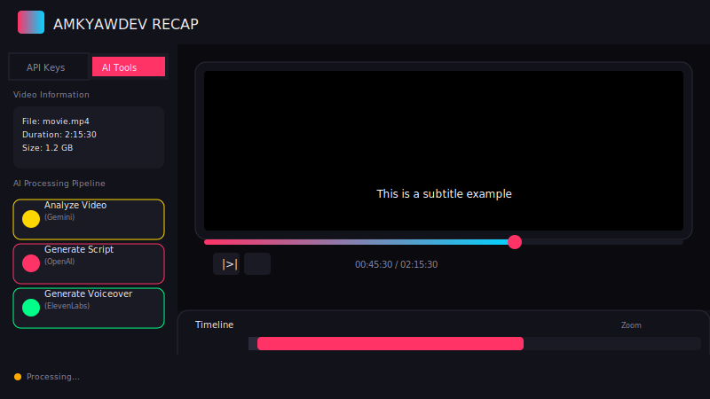
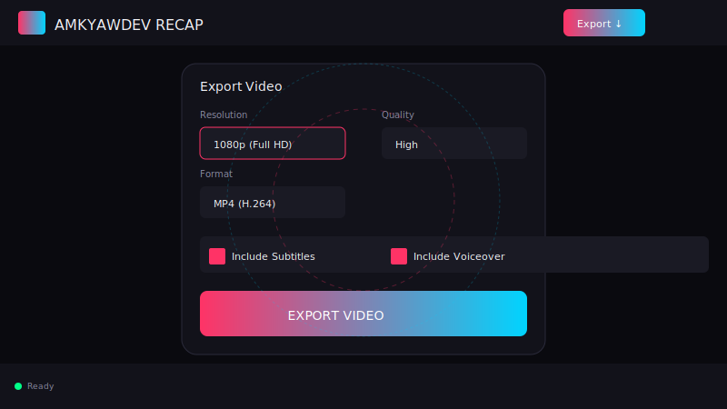

# 🎬 AmkyawDev Recap - AI-Powered Movie Recap Generator

A browser-based video editing tool that transforms movies into compelling recap videos with AI-generated narration, subtitles, and voiceovers.


## ✨ Features

### 🎥 Video Editing
- **Drag & Drop Upload** - Support for MP4, MOV, AVI, WebM, MKV (up to 2GB)
- **Video Preview** - Play, pause, scrub, and preview with playback controls
- **Timeline Editor** - Visual timeline with video, audio, and subtitle tracks
- **Real-time Preview** - See changes instantly

### 🤖 AI Processing Pipeline
- **Video Analysis** (Gemini API) - Scene detection, key moment identification
- **Script Generation** (OpenAI API) - Compelling narrative with multiple styles
- **Subtitle Generation** - Timestamped subtitles with editable interface
- **Voiceover** (ElevenLabs API) - Natural-sounding AI voice synthesis

### 🎨 Design
- **Neon Cinema Theme** - Dark, immersive interface inspired by editing suites
- **Responsive Design** - Works on desktop and tablet
- **Smooth Animations** - Modern UI with micro-interactions

## 📸 Screenshots

### Video Upload & Preview


### AI Processing Pipeline


### Export Settings


## 🛠️ Installation

```bash
# Clone the repository
git clone https://github.com/amkyawdev/amkyawdev-recap.git
cd amkyawdev-recap

# Install dependencies
npm install

# Start development
npm run dev          # Frontend (Terminal 1)
npm run server       # Backend API (Terminal 2)
```

Or run both together:
```bash
npm run dev:full
```

## ⚙️ Configuration

1. Open the app in your browser (usually http://localhost:5173)
2. Go to **API Keys** tab in the sidebar
3. Enter your API keys:
   - **Gemini API Key** - For video analysis
   - **OpenAI API Key** - For script generation
   - **ElevenLabs API Key** - For voiceover

## 📁 Project Structure

```
amkyawdev-recap/
├── public/
│   └── images/
│       ├── demo1.svg         # Upload interface screenshot
│       ├── demo2.svg         # AI processing screenshot
│       └── demo3.svg         # Export settings screenshot
├── server/
│   └── index.js              # Express API server
├── src/
│   ├── components/
│   │   ├── Header.jsx        # Header with logo & export button
│   │   ├── Sidebar.jsx       # API settings & AI tools panel
│   │   ├── VideoPreview.jsx   # Video player with drag-drop upload
│   │   ├── Timeline.jsx       # Video/audio/subtitle tracks
│   │   ├── ScriptEditor.jsx   # Script text editor
│   │   ├── SubtitleEditor.jsx # Subtitle list with edit capability
│   │   ├── ProcessingModal.jsx # Progress overlay modal
│   │   ├── ToastContainer.jsx # Toast notifications
│   │   └── Footer.jsx        # Status bar
│   ├── store/
│   │   └── useAppStore.js    # Zustand state management
│   ├── utils/
│   │   └── api.js            # API utility functions
│   ├── App.jsx               # Main application component
│   ├── main.jsx              # React entry point
│   └── index.css             # Global styles (Neon Cinema theme)
├── index.html                # HTML entry point
├── package.json              # Dependencies & scripts
├── vite.config.js            # Vite configuration
└── README.md                  # This file
```

## 🎯 Usage Workflow

### 1️⃣ Upload Video
- Drag & drop a video file onto the upload zone
- Or click to browse files
- Wait for upload to complete

### 2️⃣ AI Processing
- Click **"Analyze Video (Gemini)"** to detect scenes
- Click **"Generate Script (OpenAI)"** to create narration
- Edit the script as needed
- Click **"Generate Voiceover"** to create audio

### 3️⃣ Edit Subtitles
- Subtitles are auto-generated with the script
- Click any subtitle to jump to that timestamp
- Edit text directly in the input field
- Add or delete subtitles as needed

### 4️⃣ Export
- Go to **Export Settings** in the sidebar
- Choose resolution (720p, 1080p, 4K)
- Select quality and format
- Click **Export Video**

## 🔧 Tech Stack

### Frontend
- React 18 with Vite
- Zustand (state management)
- Framer Motion (animations)
- Lucide React (icons)

### Backend
- Node.js with Express
- Multer (file uploads)
- FFmpeg (video processing)

### AI Services
- Google Gemini (video analysis)
- OpenAI GPT (script generation)
- ElevenLabs (voice synthesis)

## 📡 API Endpoints

| Method | Endpoint | Description |
|--------|----------|-------------|
| POST | `/api/upload` | Upload video file |
| POST | `/api/analyze` | Analyze video (Gemini) |
| POST | `/api/generate-script` | Generate script (OpenAI) |
| POST | `/api/generate-subtitles` | Generate subtitles |
| POST | `/api/generate-voiceover` | Generate voiceover |
| POST | `/api/export` | Export final video |
| GET | `/api/progress/:jobId` | Get export progress |
| GET | `/api/voices` | List available voices |

## ⌨️ Keyboard Shortcuts

| Key | Action |
|-----|--------|
| Space | Play/Pause |
| ← → | Frame by frame |
| S | Split at playhead |
| Delete | Delete selected |

## 🔑 Getting API Keys

- **Gemini API**: https://makersuite.google.com/app/apikey
- **OpenAI API**: https://platform.openai.com/api-keys
- **ElevenLabs API**: https://elevenlabs.io/profile

## 📝 License

MIT License - Feel free to use and modify!

## 👨‍💻 Author

**AmkyawDev** - https://github.com/amkyawdev

---

Made with ❤️ using React + Node.js + AI
